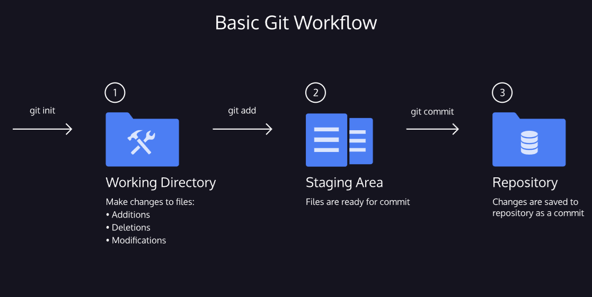

link to lesson
https://www.codecademy.com/journeys/full-stack-engineer/paths/fscj-22-building-interactive-websites/tracks/fscj-22-git-and-github-part-i/modules/wdcp-22-basic-git-workflow-1e5a88bc-78d9-4b4c-8e1c-4d7d0aaa486c/lessons/git-workflow/exercises/git-generalizations

# BASIC GIT WORKFLOW

### Generalizations

You have now been introduced to the fundamental Git workflow. You learned a lot! Let’s take a moment to generalize:

- Git is the industry-standard version control system for web developers
- Use Git commands to help keep track of changes made to a project:
  - git init creates a new Git repository
  - git status inspects the contents of the working directory and staging area
  - git add adds files from the working directory to the staging area
  - git diff shows the difference between the working directory and the staging area
  - git commit permanently stores file changes from the staging area in the repository
  - git log shows a list of all previous commits

