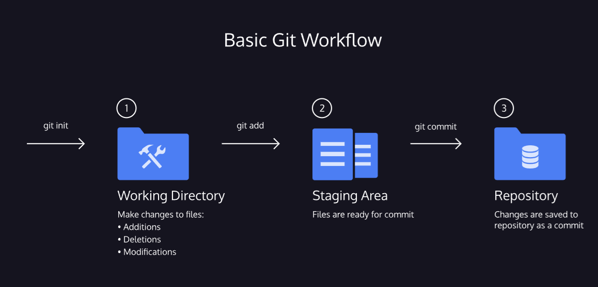

link to lesson:

https://www.codecademy.com/journeys/full-stack-engineer/paths/fscj-22-building-interactive-websites/tracks/fscj-22-git-and-github-part-i/modules/wdcp-22-basic-git-workflow-1e5a88bc-78d9-4b4c-8e1c-4d7d0aaa486c/lessons/git-workflow/exercises/git-workflow

# BASIC GIT WORKFLOW

### Git Workflow

Nice! We have a Git project. A Git project can be thought of as having three parts:

1. A Working Directory: where you’ll be doing all the work: creating, editing, deleting and organizing files
2. A Staging Area: where you’ll list changes you make to the working directory
3. A Repository: where Git permanently stores those changes as different versions of the project

The Git workflow consists of editing files in the working directory, adding files to the staging area, and saving changes to a Git repository. In Git, we save changes with a commit, which we will learn more about in this lesson.

### Instructions
Take a look at the diagram. Before we move on, it will help to be familiar with the three parts of the Git workflow. Click Next to continue.

